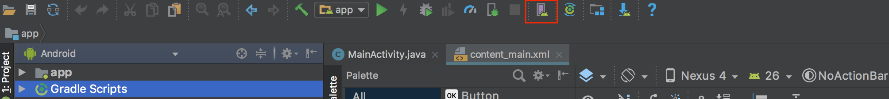
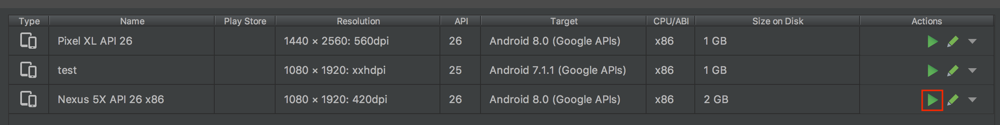

# TodoApp
#
```bash
$ git clone https://github.com/kukiat/todo-app-reactnative.git
$ cd todo-app-reactnative
$ npm install
```
# installation
  - install NodeJS
  - install watchman
# For ios
  - install Xcode last version
```bash
$ npm start
$ react-native run-ios
```

# For android
  - install Android Studio
  - Install the Android SDK
```bash
$ export ANDROID_HOME=$HOME/Library/Android/sdk 
$ export PATH=$PATH:$ANDROID_HOME/tools:$ANDROID_HOME/platform-tools
$ source $HOME/.bash_profile
```
- Open Android Studio
- Open Android Emulator 


 ```bash
$ npm start
$ react-native run-android
```